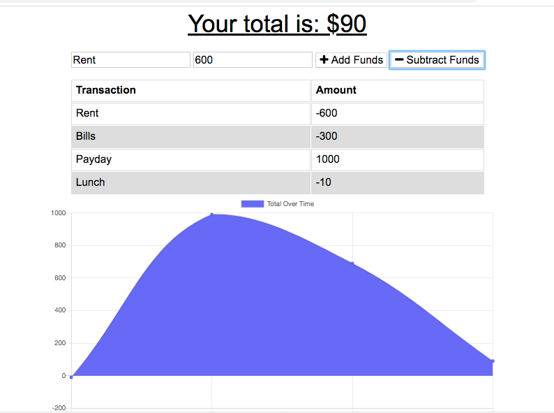

# Budget Tracker

Budget Tracker gives users a fast and easy way to track their money. The application allows for offline access and functionality. When entering transactions offline, your total is populated when brought back online.

## User Story

* AS AN avid traveller
* I WANT to be able to track my withdrawals and deposits with or without a data/internet connection
* SO THAT my account balance is accurate when I am traveling

## Installation
### To run locally:
* Navigate to the project's root directory and run `npm install`
* The application is invoked with the command `npm start`

## Domains
* Budget Tracker is currently being hosted on [Heroku](https://heroku.com/) at https://pure-springs-86633.herokuapp.com/

## Built with:
* Javascript, Node
* [Express](https://www.npmjs.com/package/express/)
* [Mongoose](https://www.npmjs.com/package/mongoose)

## Contact
#### Email
* brittanie.boyko@gmail.com
